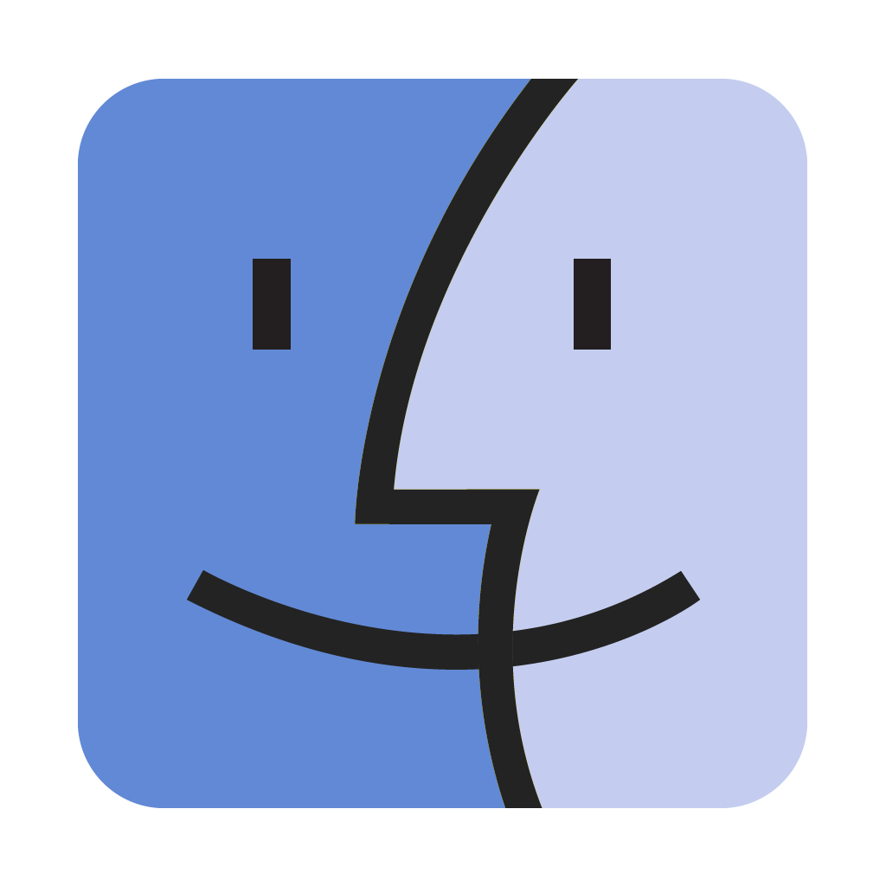
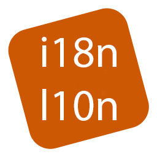

# About Me

I am a software developer with over 30 years experience. I am current specialising in App development using Flutter and VSCode Extensions. I am able to do full development cycle including requirements gathering, data risk analyst, design, full stack development, documentation and releases.

  &nbsp;&nbsp;
  &nbsp;&nbsp;
  &nbsp;&nbsp;
  &nbsp;&nbsp;
  &nbsp;&nbsp;
  

<table border="0">
<tr><td colspan="14"><h2>Technologies</h2></td></tr>
<tr>
<th>Languages</th>
<td></td>
<td></td>
<td></td>
<td></td>
<td></td>
<td></td>
<td></td>
<td></td>
<td></td>
<td></td>
<td></td>
<td></td>
<td></td>
</tr>
<tr><th>Tools</th>
<td></td>
<td></td>
<td></td>
<td></td>
<td></td>
<td></td>
<td></a> </td>
<td></td>
<td></td>
<td></td>
<td></td>
<td></td>
<td></td>
</tr>
<tr><th>Developer</th>
<td></td>
<td></td>
<td></td>
<td></td>
<td></td>
<td></td>
<td></td>
<td></td>
<td></td>
<td></td>
<td></td>
<td></td>
<td></td>
</tr>
<tr><th>Releases</th>
<td></td>
<td></td>
<td></td>
<td></td>
<td></td>
<td></td>
<td></td>
<td></td>
<td></td>
<td></td>
<td></td>
<td></td>
<td></td>
</tr>
<tr><th>Socials</th>
<td></td>
<td></td>
<td></td>
<td></td>
<td></td>
<td></td>
<td></td>
<td></td>
<td></td>
<td></td>
<td></td>
<td></td>
<td></td>
</tr>
<tr><th>Sponsor Me</th>
<td></td>
<td></td>
<td></td><td></td><td></td><td></td><td></td><td></td><td></td><td></td><td></td><td></td><td></td></tr>

<table border="0">
<tr><td colspan="3"><h2>Statistics</h2></td></tr>
<tr><td width="100%" colspan="3">
</td></tr>
<tr>
<td>
    
</td>
<td>

</td>
<td>

</td>
</tr>
</table>

<!--
**DionJChapman/DionJChapman** is a ✨ _special_ ✨ repository because its `README.md` (this file) appears on your GitHub profile.

Here are some ideas to get you started:

- 🔭 I’m currently working on ...
- 🌱 I’m currently learning ...
- 👯 I’m looking to collaborate on ...
- 🤔 I’m looking for help with ...
- 💬 Ask me about ...
- 📫 How to reach me: ...
- 😄 Pronouns: ...
- ⚡ Fun fact: ...
-->
